# 🛒 E-Commerce System 

Dự án được xây dựng theo mô hình **Layered Architecture (Controller → Service → Repository)** giúp mã nguồn dễ bảo trì, mở rộng và tuân thủ nguyên tắc tách biệt trách nhiệm. Hệ thống gồm **backend Spring Boot, frontend React, PostgreSQL, Redis,** tích hợp **VNPay** để xử lý thanh toán trực tuyến an toàn và nhanh chóng. Toàn bộ kiến trúc được thiết kế hướng tới hiệu năng cao, dễ mở rộng và phù hợp cho các hệ thống thương mại điện tử hiện đại.


---
[](https://openjdk.org/) [](https://spring.io/projects/spring-boot) [](https://www.postgresql.org/) [](LICENSE)  
---

# 👥 Thành viên thực hiện
* **Nguyễn Bá Vũ Khoa** – 3122411097
* **Đặng Minh Hào** – 3122411047
* **Vũ Văn Minh** – 3122411129
* **Lại Trần Trung Kiên** – 3122411102
* **Vũ Hoàng Chung** –  3122560007

---

## Mục lục

- [🛒 E-Commerce System](#-e-commerce-system)
  - [     ](#-----)
- [👥 Thành viên thực hiện](#-thành-viên-thực-hiện)
  - [Mục lục](#mục-lục)
  - [✨ Tính Năng Chính (Key Features)](#-tính-năng-chính-key-features)
  - [🏗️ Kiến trúc tổng thể](#️-kiến-trúc-tổng-thể)
    - [Conceptual Model](#conceptual-model)
      - [Các Phân Hệ Chức Năng Chính](#các-phân-hệ-chức-năng-chính)
      - [Các Mối Quan Hệ](#các-mối-quan-hệ)
    - [C4 Model](#c4-model)
      - [1. Tổng quan Kiến trúc Hệ thống (C1 - System Context)](#1-tổng-quan-kiến-trúc-hệ-thống-c1---system-context)
      - [2. Kiến trúc Container (C2 - Container View)](#2-kiến-trúc-container-c2---container-view)
      - [3. Kiến trúc Component (C3 - Backend Structure)](#3-kiến-trúc-component-c3---backend-structure)
      - [4. Chi tiết Mã nguồn (C4 - Code Level)](#4-chi-tiết-mã-nguồn-c4---code-level)
  - [🛠 Công nghệ sử dụng](#-công-nghệ-sử-dụng)
  - [📂 Cấu trúc thư mục (tóm tắt)](#-cấu-trúc-thư-mục-tóm-tắt)
  - [📚 Yêu cầu](#-yêu-cầu)
  - [⚙️ Cài đặt \& Chạy dự án](#️-cài-đặt--chạy-dự-án)
  - [📡 API Documentation](#-api-documentation)
    - [Swagger UI](#swagger-ui)
    - [Các endpoint chính](#các-endpoint-chính)
      - [🔐 Authentication](#-authentication)
      - [Product](#product)
      - [Cart](#cart)
      - [Order](#order)
      - [Payment](#payment)
  - [📝Response Schema](#response-schema)
  - [🛡️Bảo mật](#️bảo-mật)
    - [Authentication \& Authorization](#authentication--authorization)
    - [Security Features](#security-features)
  - [⚡ Redis \& Security Strategy](#-redis--security-strategy)
  - [🧪Testing](#testing)
  - [🐳 Docker \& Triển khai (Deployment)](#-docker--triển-khai-deployment)
  - [🌐 Deployment Production \& Monitoring](#-deployment-production--monitoring)
  - [📊 Monitoring](#-monitoring)
    - [Health Checks](#health-checks)
    - [Metrics](#metrics)
    - [Logging](#logging)
  - [📄 License](#-license)

---

## ✨ Tính Năng Chính (Key Features)

Hệ thống cung cấp đầy đủ các chức năng của một sàn thương mại điện tử cơ bản, tập trung vào hiệu suất và bảo mật.


**👤 Quản lý Người dùng (User Management)**
* Đăng ký và Đăng nhập (Authentication).
* Phân quyền người dùng dựa trên vai trò (Role-based Authorization - ADMIN/USER).
* Quản lý thông tin cá nhân (Profile).

**📦 Quản lý Sản phẩm (Product Catalog)**
* Hỗ trợ đầy đủ thao tác **CRUD** (Tạo, Xem chi tiết, Cập nhật, Xóa).
* Tìm kiếm và lọc sản phẩm (tùy chọn mở rộng).

**🛒 Giỏ hàng (Shopping Cart)**
* Thêm sản phẩm vào giỏ hàng.
* Cập nhật số lượng hoặc xóa sản phẩm khỏi giỏ.
* Đồng bộ trạng thái giỏ hàng thời gian thực.

**🧾 Quản lý Đơn hàng (Order Processing)**
* Quy trình đặt hàng (Checkout) hoàn chỉnh.
* Xem lịch sử đơn hàng đã đặt.
* Cập nhật trạng thái đơn hàng (cho Admin/Manager).

**💳 Tích hợp Thanh toán (Payment Integration)**
* Tích hợp cổng thanh toán VNPay.
* Xử lý thanh toán an toàn và nhanh chóng.

---

## 🏗️ Kiến trúc tổng thể

<div align="center">
  
</div>

<div align="center">
  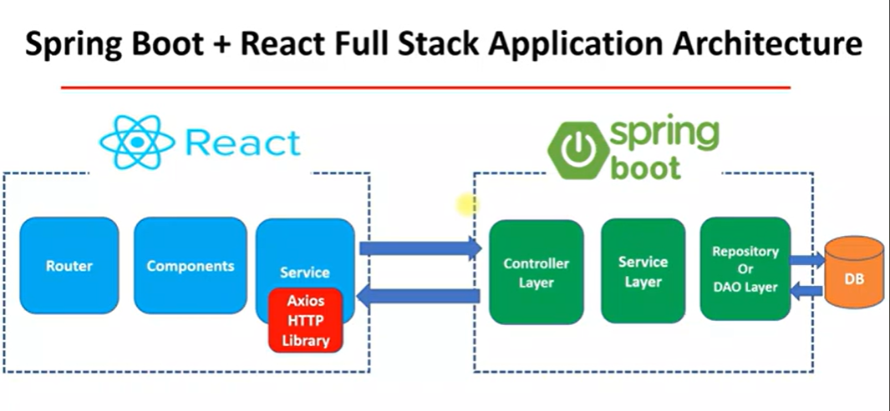
</div>
### Conceptual Model

<div align="center">
  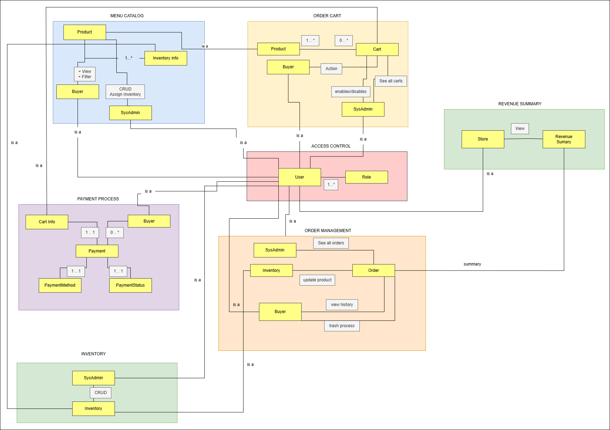
</div>

#### Các Phân Hệ Chức Năng Chính

**Kiểm Soát Truy Cập (Hộp Hồng - Trung Tâm)**
* Đây là phần cốt lõi của hệ thống quản lý người dùng.
* Nó định nghĩa một thực thể **User** (Người dùng) chung được liên kết với **Roles** (Vai trò) (1 người dùng có thể có nhiều vai trò).
* Các tác nhân **Buyer** (Người mua) và **SysAdmin** (Quản trị viên hệ thống) trong các mô-đun khác đều kế thừa từ thực thể User này (được biểu thị bằng các đường liên kết "is a").

**Danh Mục Thực Đơn (Hộp Xanh Dương)**
* Tập trung vào việc hiển thị và quản lý sản phẩm.
* **SysAdmin:** Có các quyền CRUD (Tạo, Đọc, Cập nhật, Xóa) và phân bổ kho hàng.
* **Buyer:** Có thể Xem và Lọc sản phẩm.
* **Product:** Được liên kết với thông tin **Inventory** (Kho hàng).

**Giỏ Hàng (Hộp Vàng)**
* Quản lý trải nghiệm mua sắm.
* **Buyer:** Có thể thực hiện các Hành động trên Giỏ hàng.
* **Cart:** Chứa các Sản phẩm (Bản số: 1 Giỏ hàng có thể có từ 0 đến nhiều Sản phẩm).
* **SysAdmin:** Có thể xem tất cả các giỏ hàng và kích hoạt/vô hiệu hóa chúng.

**Quy Trình Thanh Toán (Hộp Tím)**
* Xử lý logic giao dịch.
* **Buyer:** Khởi tạo thanh toán dựa trên Thông tin Giỏ hàng.
* **Payment:** Được kết nối với một **PaymentMethod** (Phương thức thanh toán) cụ thể (ví dụ: Thẻ tín dụng) và **PaymentStatus** (Trạng thái thanh toán) (ví dụ: Đang chờ, Đã thanh toán) theo mối quan hệ 1-1.

**Quản Lý Đơn Hàng (Hộp Cam)**
* Xử lý vòng đời của đơn hàng sau khi đặt.
* **Order:** Cập nhật Kho hàng và đóng vai trò dữ liệu tổng hợp cho doanh thu.
* **Buyer:** Có thể Xem lịch sử và thực hiện các quy trình xóa bỏ/hủy.
* **SysAdmin:** Có thể Xem tất cả đơn hàng.

**Kho Hàng (Hộp Xanh Lá - Dưới Cùng Bên Trái)**
* Dành riêng cho việc quản lý tồn kho.
* **SysAdmin:** Thực hiện các thao tác CRUD trên Kho hàng.

**Tổng Hợp Doanh Thu (Hộp Xanh Lá - Trên Cùng Bên Phải)**
* Tập trung vào báo cáo kinh doanh.
* **Store:** Có thể Xem Tổng hợp Doanh thu.

#### Các Mối Quan Hệ
* **"is a"**: Dòng này biểu thị sự kế thừa. Ví dụ, trong hộp "Quy Trình Thanh Toán", thực thể "Buyer" chính là một "User" từ hộp Kiểm Soát Truy Cập.
* **Associations (Liên kết)**: Các đường nối giữa các thực thể (như từ Product đến Cart) thể hiện mối quan hệ dữ liệu, thường đi kèm với bản số (ví dụ: `1..*` nghĩa là quan hệ "một - nhiều").

### C4 Model

#### 1. Tổng quan Kiến trúc Hệ thống (C1 - System Context)
Đây là bức tranh toàn cảnh về cách hệ thống tương tác với thế giới bên ngoài.

<div align="center">
  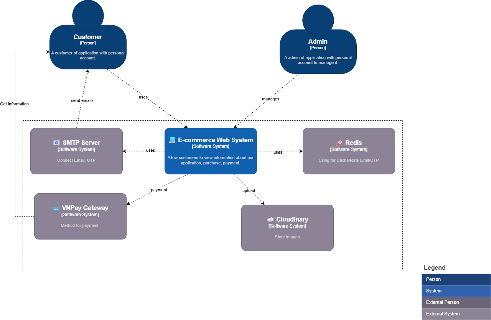
</div>

* **Người dùng (Actors):**
    * **Customer:** Người mua hàng, thực hiện xem sản phẩm, đặt hàng, thanh toán.
    * **Admin:** Quản trị viên, quản lý sản phẩm, đơn hàng và báo cáo hệ thống.
* **Hệ thống chính:** **E-commerce Web System** đóng vai trò trung tâm xử lý mọi nghiệp vụ.
* **Hệ thống bên ngoài (External Systems):**
    * **VNPay Gateway:** Cổng thanh toán để xử lý giao dịch tiền tệ.
    * **Cloudinary:** Dịch vụ lưu trữ đám mây chuyên dụng cho hình ảnh sản phẩm (giúp giảm tải cho server chính).
    * **SMTP Server:** Hệ thống gửi email tự động (xác thực tài khoản, OTP, thông báo đơn hàng).
    * **Redis:** Hệ thống lưu trữ bộ nhớ đệm (Cache), dùng để lưu OTP, session, và giới hạn tần suất truy cập (Rate Limiting).

#### 2. Kiến trúc Container (C2 - Container View)
Phần này mô tả các "thùng chứa" công nghệ và giao thức giao tiếp.

<div align="center">
  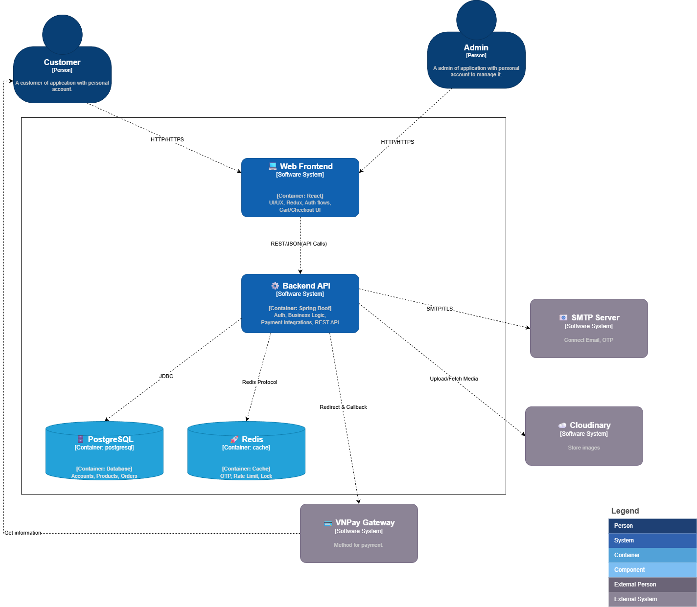
</div>

* **Web Frontend (React):**
    * Chịu trách nhiệm hiển thị giao diện (UI/UX).
    * Giao tiếp với Backend qua giao thức HTTPS (RESTful API/JSON).
* **Backend API (Spring Boot):**
    * Là trái tim của hệ thống, chứa toàn bộ Business Logic.
    * Xử lý xác thực (Auth), nghiệp vụ bán hàng, và tích hợp bên thứ 3.
* **Cơ sở dữ liệu & Cache:**
    * **PostgreSQL:** Database chính (Relational DB) lưu trữ Account, Product, Order... Giao tiếp qua JDBC.
    * **Redis:** Lưu trữ dữ liệu tạm thời (OTP, Token blacklist, Rate limit data). Giao tiếp qua Redis Protocol.

#### 3. Kiến trúc Component (C3 - Backend Structure)
Backend được chia thành các lớp (Layered Architecture) và các Module nghiệp vụ riêng biệt để dễ bảo trì.

**C3 - High Level Component**
<div align="center">
  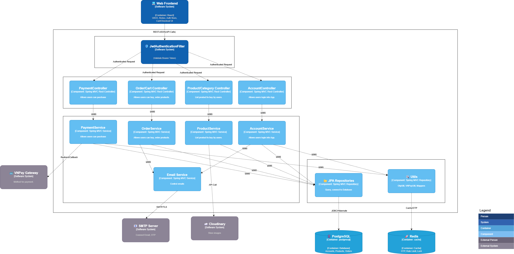
</div>

**C3 - Module Level Component**
<div align="center">
  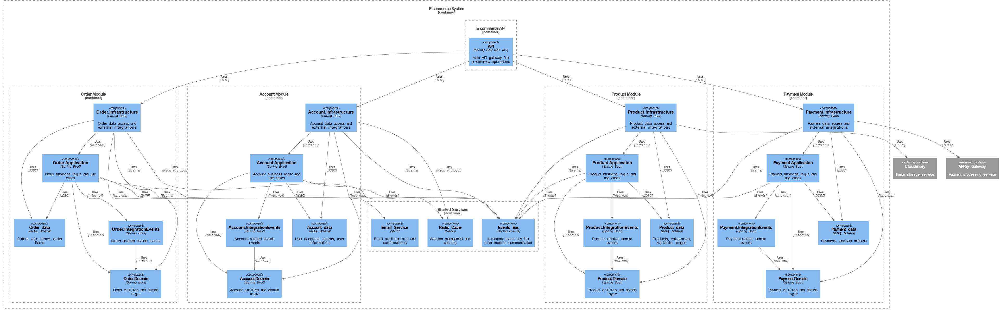
</div>

* **Phân lớp (Layers):**
    * **Security Layer (JwtAuthenticationFilter):** Chốt chặn đầu tiên, kiểm tra Token (JWT) của mọi request trước khi cho phép đi vào bên trong.
    * **Controller Layer (REST):** Tiếp nhận request từ Frontend (AccountController, OrderController...).
    * **Service Layer (Business Logic):** Xử lý nghiệp vụ chính (AccountService, OrderService...).
    * **Repository Layer (JPA):** Tương tác trực tiếp với Database.
    * **Utils:** Các tiện ích hỗ trợ như VNPayUtil (tạo URL thanh toán), OtpUtil (sinh mã OTP).
* **Phân chia Module (Module-level):**
    * Hệ thống chia thành 4 module lớn, giảm thiểu sự phụ thuộc chéo:
        * **Account Module:** Quản lý đăng nhập, đăng ký, thông tin User.
        * **Product Module:** Quản lý danh mục, sản phẩm, biến thể (Option).
        * **Order Module:** Quản lý giỏ hàng và quy trình đặt hàng.
        * **Payment Module:** Xử lý thanh toán và đối soát với VNPay.

#### 4. Chi tiết Mã nguồn (C4 - Code Level)
Đây là phần chi tiết nhất về cấu trúc Class/Entity cho từng phân hệ quan trọng.

**A. Account/Auth Aggregate (Xác thực & Người dùng)**
<div align="center">
  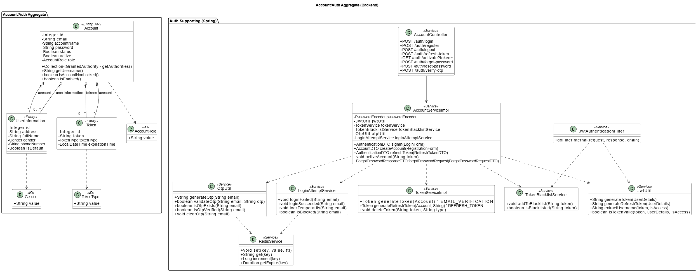
</div>

* **Entity chính:**
    * **Account:** Chứa email, password, role.
    * **Token:** Quản lý Refresh Token và thiết bị đăng nhập.
    * **UserInformation:** Thông tin cá nhân mở rộng (địa chỉ, SĐT).
* **Luồng xử lý chính:**
    * **Đăng nhập/Đăng ký:** `AccountController` gọi `AccountServiceImpl`. Service này sử dụng `AuthenticationManager` để xác thực, sau đó dùng `JwtUtil` để sinh Access Token + Refresh Token.
    * **OTP & Security:** `OtpUtil` kết hợp với `RedisService` để lưu mã OTP có thời hạn (TTL). `TokenBlacklistService` chặn các token đã đăng xuất.

**B. Product/Catalog Aggregate (Sản phẩm)**
<div align="center">
  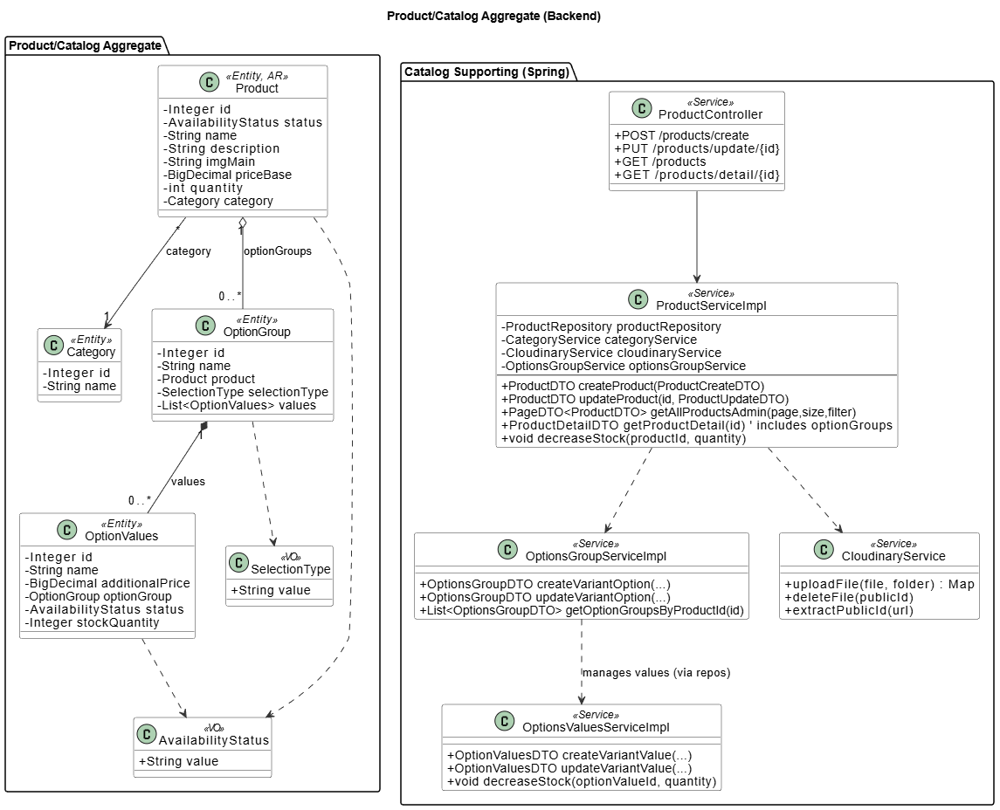
</div>

* **Entity chính:**
    * **Product:** Thông tin cơ bản (tên, giá, ảnh). Liên kết N-1 với Category.
    * **OptionGroup & OptionValues:** Thiết kế linh hoạt cho các món ăn có nhiều tùy chọn (ví dụ: Mức đá, Mức đường, Topping thêm). Đây là điểm sáng giúp hệ thống bán được đồ ăn phức tạp.
* **Logic nổi bật:**
    * `ProductServiceImpl` tích hợp với `CloudinaryService` để upload ảnh lên mây, lấy về URL lưu vào DB.

**C. Orders/Cart Aggregate (Đơn hàng)**
<div align="center">
  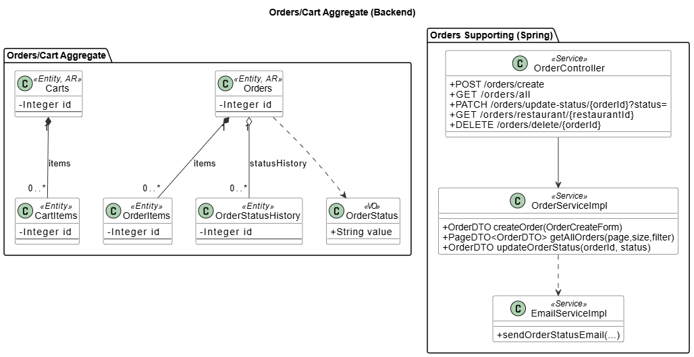
</div>

* **Entity chính:**
    * **Carts & CartItems:** Lưu giỏ hàng tạm thời của user.
    * **Orders & OrderItems:** Đơn hàng chính thức sau khi chốt đơn.
    * **OrderStatusHistory:** Lưu vết lịch sử thay đổi trạng thái đơn (Created -> Pending -> Paid -> Delivering...) giúp tracking dễ dàng.
* **Logic:**
    * `OrderServiceImpl` chịu trách nhiệm chuyển đổi dữ liệu từ Cart sang Order, trừ tồn kho và gọi `EmailService` để gửi mail xác nhận.

**D. Payment Aggregate (Thanh toán)**
<div align="center">
  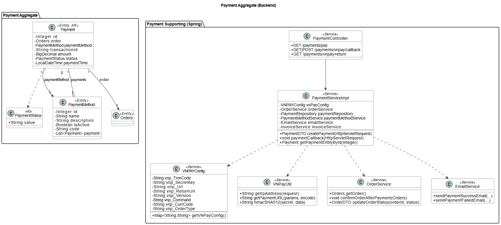
</div>

* **Entity chính:**
    * **Payment:** Lưu thông tin giao dịch, số tiền, mã giao dịch (TransactionId).
    * **PaymentMethod:** Quản lý các phương thức (VNPay, COD, Momo...).
* **Luồng thanh toán VNPay:**
    1.  User chọn thanh toán -> `PaymentServiceImpl` dùng `VNPayUtil` & `VNPAYConfig` để tạo URL có chữ ký bảo mật (HMAC SHA512).
    2.  User chuyển sang VNPay thanh toán.
    3.  VNPay gọi ngược lại (Callback) -> `PaymentController` nhận tín hiệu, xác minh chữ ký, sau đó cập nhật trạng thái Orders sang "PAID" và gửi email thông báo.
---

## 🛠 Công nghệ sử dụng

* **Frontend:** React, Vite, Axios
* **Backend:** Java, Spring Boot, Spring Security, Spring Data JPA
* **Database:** PostgreSQL
* **Cache:** Redis
* **Security:** JWT, Bcrypt
* **Payment:** Cổng thanh toán VNPay
* **Testing:** JUnit 5, Mockito, Testcontainers
* **API Testing:** Postman
* **DevOps & Monitor:** Docker, Prometheus, Grafana
* **Build Tools:** npm, Maven

---

## 📂 Cấu trúc thư mục (tóm tắt)

Backend (Spring Boot)
```
backend/
 └── src/main/java/com/ecommerce/
     ├── config/
     ├── controller/
     ├── service/
     │     └── impl/
     ├── repository/
     ├── dto/
     ├── mapper/
     ├── entity/
     ├── exceptions/
     ├── orther/
     ├── enums/
     ├── util/
     ├── specification/
     └── EcommerceApplication.java
```

Frontend (React)
```
frontend/
 ├── src/
 │   ├── api/
 │   ├── components/
 │   ├── pages/
 │   ├── hooks/
 │   ├── store/   
 │   └── App.jsx
 └── public/
```

---

## 📚 Yêu cầu
- Java 17+
- Maven
- Node.js 16+
- Docker & Docker Compose (khuyến nghị)
- PostgreSQL
- Redis

---

## ⚙️ Cài đặt & Chạy dự án

1. Clone repository
```bash
git clone https://github.com/haolor/ktpm-team.git
cd ktpm-team
```

2. Backend
```bash
cd backend

# copy file môi trường mẫu và chỉnh sửa 
cp .env.example

# build & run
./mvnw clean package
./mvnw spring-boot:run

# hoặc chạy jar
java -jar target/ecommerce-*.jar
```
Server sẽ khởi động tại: http://localhost:8080/api/v1/

3. Frontend
```bash
cd frontend

cp .env.example

npm install
npm run dev

# hoặc
npm run build
serve -s build
```

---

## 📡 API Documentation
Tài liệu mô tả các RESTful API của hệ thống Backend.

* **Base URL**: `http://localhost:8080/api/v1`
* **Content-Type**: `application/json`
* **Authentication**: Bearer Token (JWT)
* **Version**: v1
* **Format**: JSON
* **Pagination**: Sử dụng `page` và `size` làm query parameters

### Swagger UI
Sau khi khởi động ứng dụng, truy cập:
```
http://localhost:8080/api/v1/swagger-ui/index.html
```
<div align="center">
  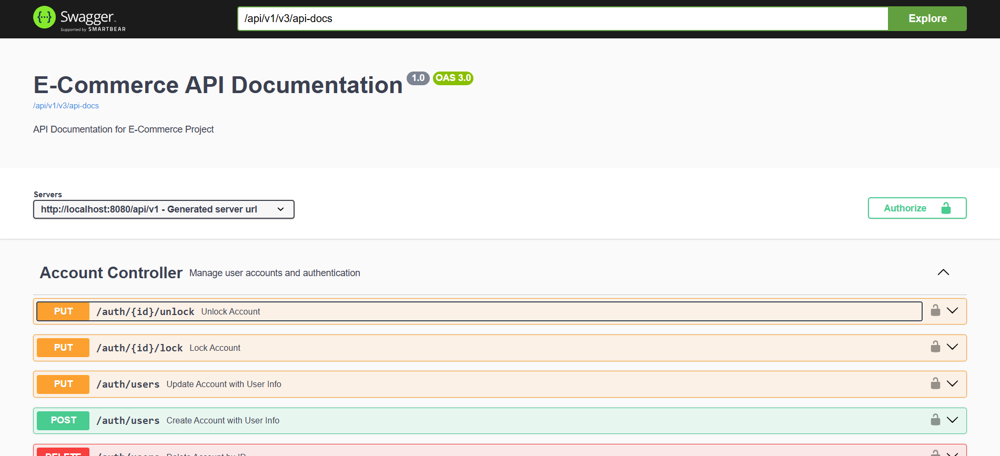
</div>


### Các endpoint chính
#### 🔐 Authentication
- POST /auth/register — đăng ký người dùng mới
  - body: {username, password, email, roles}
  - Response: 201 {id, username, email, roles}
- POST /auth/login — đăng nhập
  - body: {username, password}
  - Response: 200 {token, type, id, username, email, roles}
- GET  /auth/me — lấy thông tin người dùng hiện tại 
  - Protected: Có
- PUT  /auth/me — cập nhật thông tin người dùng hiện tại 
  - Protected: Có
  - body: {email, password, ...}
  - Response: 200 {id, username, email, roles}
- GET  /auth/users — danh sách người dùng (ADMIN)
  - Protected: Có
  - hỗ trợ pagination và filter
- GET  /auth/users/{id} — chi tiết người dùng (ADMIN)
  - Protected: Có
  - Response: 200 {id, username, email, roles}
- DELETE /auth/users/{id} — xóa người dùng (ADMIN)
  - Protected: Có
- PUT  /auth/users/{id} — cập nhật người dùng (ADMIN)
  - Protected: Có
  - body: {email, roles, ...}
  - Response: 200 {id, username, email, roles}
- POST /auth/refresh-token — làm mới token
  - body: {refreshToken}
- POST /auth/logout — đăng xuất
  - body: {refreshToken}
  - Protected: Có
- POST /auth/forgot-password — quên mật khẩu
  - body: {email}
  - Response: 200 {message}
- POST /auth/reset-password — đặt lại mật khẩu
  - body: {token, currentPassword, newPassword}
  - Response: 200 {message}
  - Protected: Có

----

#### Product
- GET  /products — danh sách sản phẩm 
  - hỗ trợ pagination, filter, sort
  - query params: page, size, category, priceMin, priceMax, sortBy, sortDir
  - Response: 200 {content: [...], page, size, totalElements, totalPages}
- POST /products/search — tìm kiếm sản phẩm
  - body: {keyword, page, size, sortBy, sortDir}
  - Response: 200 {content: [...], page, size, totalElements, totalPages}
  - hỗ trợ pagination và sort
- GET  /products/{id} — chi tiết sản phẩm
  -  Response: 200 {id, name, description, price, stock, category, images, createdAt, updatedAt}
- POST /products — tạo sản phẩm (ADMIN)
  - body: {name, description, price, stock, category, images}
  - Response: 201 {id, name, description, price, stock, category, images, createdAt, updatedAt}
  - Protected: Có
- PUT  /products/{id} — cập nhật sản phẩm (ADMIN)
  - body: {name, description, price, stock, category, images}
  - Response: 200 {id, name, description, price, stock, category, images, createdAt, updatedAt}
  - Protected: Có
- DELETE /products/{id} — xóa sản phẩm (ADMIN)
  - Protected: Có

---

#### Cart

- POST /cart/add — thêm vào giỏ hàng
  -  body: {productId, quantity}
  -  Response: 201 {cartId, items: [...], totalPrice}
  -  Protected: Có
- GET  /cart/{id} — lấy chi tiết giỏ hàng
  - Protected: Có
  - Response: 200 {cartId, items: [...], totalPrice}
- DELETE /cart/remove/{productId} — xóa khỏi giỏ hàng
  - Protected: Có
- PUT  /cart/update — cập nhật số lượng
  - body: {productId, quantity}
  - Protected: Có
- GET  /cart/user/{id} — lấy giỏ hàng của user
  - Protected: Có
- DELETE /cart/clear — xóa toàn bộ giỏ hàng
  - Protected: Có

--- 
#### Order
- POST /orders — tạo đơn hàng
    - body: {cartId, shippingAddress, paymentMethod}
    - Response: 201 {orderId, status, totalAmount, createdAt}
    - Protected: Có
- GET  /orders/{id} — chi tiết đơn hàng
  - Protected: Có
- GET  /orders — danh sách đơn hàng (ADMIN)
  - Protected: Có
  - hỗ trợ pagination và filter
- GET  /orders?page=&size=&status= — lọc đơn hàng theo trạng thái (ADMIN)
  - Protected: Có
- GET  /orders/user/{id} — đơn hàng của user
  - Protected: Có
- PUT  /orders/{id}/status — cập nhật trạng thái (ADMIN)
  - body: {status}
  - Protected: Có
- DELETE /orders/{id} — hủy đơn hàng
  - Protected: Có
- POST /orders/{id}/pay — thanh toán đơn hàng
  - body: {paymentDetails}
  - Protected: Có
  - Tích hợp VNPay
- GET  /orders/restaurant/{idRestaurant} — lấy đơn hàng theo nhà hàng (ADMIN)
  - Protected: Có
  - hỗ trợ pagination và filter

---
#### Payment
- POST /payments/vnpay — khởi tạo thanh toán VNPay
  - body: {orderId, amount, returnUrl}
  - Response: 200 {paymentUrl}
  - Protected: Có
- GET  /payments/vnpay/return — xử lý callback VNPay
  - query params: vnp_ResponseCode, vnp_TxnRef, vnp_Amount, ...
  - Response: 200 {message, orderStatus}
  

## 📝Response Schema

Tất cả API responses tuân theo cấu trúc chung sau:

```json
{
    "success": true,
    "message": "Thao tác thành công",
    "data": {
        // Object, List, hoặc Page data
    },
    "errors": null,
    "timestamp": "2024-01-15T10:30:45Z"
}
```

**Chi tiết các field:**

| Field | Kiểu | Mô tả |
|-------|------|-------|
| `success` | boolean | Trạng thái request (true = thành công, false = thất bại) |
| `message` | string | Thông báo người dùng, dễ hiểu, có thể hiển thị trên UI |
| `data` | object/array | Dữ liệu chính (Object, List, hoặc Page) |
| `errors` | object/null | Chi tiết lỗi validation nếu có (hiển thị form errors) |
| `timestamp` | string | Thời gian server phản hồi (ISO 8601) |

**Ví dụ Response thành công:**
```json
{
    "success": true,
    "message": "Lấy danh sách sản phẩm thành công",
    "data": [{"id": 1, "name": "Sản phẩm A"}],
    "errors": null,
    "timestamp": "2024-01-15T10:30:45Z"
}
```

**Ví dụ Response lỗi:**
```json
{
    "success": false,
    "message": "Dữ liệu không hợp lệ",
    "data": null,
    "errors": {"email": "Email không đúng định dạng"},
    "timestamp": "2024-01-15T10:30:45Z"
}
```


---

## 🛡️Bảo mật

### Authentication & Authorization
- **JWT Tokens**: Stateless authentication
- **BCrypt**: Password hashing
- **Role-based Access Control**: Fine-grained permissions
- **Multi-factor Authentication**: Optional 2FA

### Security Features
- **Input Validation**: Comprehensive validation
- **SQL Injection Prevention**: Parameterized queries
- **XSS Protection**: Output encoding
- **CSRF Protection**: CSRF tokens
- **Rate Limiting**: API throttling
- **Brute Force Protection**: Account lockout

---

## ⚡ Redis & Security Strategy

Trong dự án này, Redis **không** được sử dụng để cache dữ liệu tĩnh (như sản phẩm). Thay vào đó, Redis đóng vai trò cốt lõi trong việc đảm bảo **Bảo mật** và **Tính toàn vẹn dữ liệu** (Data Integrity).

| Tính năng | Key Pattern (Ví dụ) | TTL (Thời gian tồn tại) | Mục đích sử dụng |
| :--- | :--- | :--- | :--- |
| **🔐 OTP Storage** | `auth:otp:{email}` | 2 - 5 phút | Lưu mã OTP xác thực đăng ký/quên mật khẩu. Tự động hết hạn để bảo mật. |
| **🛡️ Login Guard** | `auth:login_attempts:{ip}` | 30 - 60 phút | Đếm số lần đăng nhập sai. Tạm khóa IP/User nếu vượt quá giới hạn (Chống Brute Force). |
| **🚫 Rate Limiting** | `rate_limit:{api}:{ip}` | 1 phút | Giới hạn số lượng request đến API trong một khoảng thời gian (Chống Spam/DDoS). |
| **🔒 Distributed Lock**| `lock:inventory:{prod_id}`| 10 - 30 giây | Cơ chế khóa phân tán để ngăn chặn **Race Condition** khi nhiều user cùng mua 1 sản phẩm cuối cùng. |

---

## 🧪Testing

- Unit tests: JUnit 5 + Mockito
- Integration tests: Testcontainers (Postgres, Redis)
- Chạy tests backend:
```bash
cd backend
./mvnw test
```

---

## 🐳 Docker & Triển khai (Deployment)

Dự án được đóng gói hoàn chỉnh (Containerization) giúp việc cài đặt và triển khai trở nên đồng nhất trên mọi môi trường.


File `docker-compose.yml` đã tích hợp sẵn toàn bộ các dịch vụ cần thiết để chạy ứng dụng:

* **backend-service**: Spring Boot Application (Port `8080`)
* **frontend-service**: ReactJS Application (Port `3000` hoặc `80`)
* **postgres-db**: Cơ sở dữ liệu chính (Port `5432`)
* **redis-cache**: Lưu trữ OTP, Rate Limit & Distributed Lock (Port `6379`)

**Bước 1: Cài đặt Docker**
Trước tiên, bạn cần cài đặt Docker Engine và Docker Compose trên máy tính:
* [Download Docker Desktop](https://www.docker.com/products/docker-desktop/) (Hỗ trợ Windows, Mac, Linux).
* Sau khi cài đặt, hãy đảm bảo Docker đã bật bằng cách mở ứng dụng Docker Desktop lên.

**Bước 2: Khởi chạy ứng dụng**
Mở terminal, di chuyển tới thư mục gốc của dự án (nơi chứa file `docker-compose.yml`) và chạy lệnh:

```bash
# 1. Di chuyển vào thư mục dự án (thay thế bằng tên thư mục của bạn)
cd ten-du-an

# 2. Build images và khởi động các container ở chế độ background
docker-compose up -d --build

```

---
## 🌐 Deployment Production & Monitoring
Hệ thống được deploy trên **Render** :
<div align="center">
  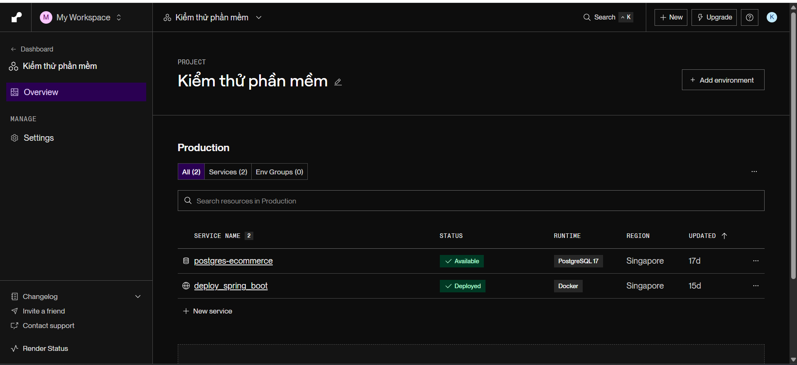
</div>

## 📊 Monitoring

### Health Checks
```bash
# Application health
curl http://localhost:8080/actuator/health

# Detailed health
curl http://localhost:8080/actuator/health/details
```
---
### Metrics
- **Spring Boot Actuator**: Built-in metrics
- **Micrometer**: Metrics facade
- **Prometheus**: Metrics collection
- **Grafana**: Visualization

### Logging
- **SLF4J + Logback**: Structured logging
- **Log levels**: Configurable per package
- **Log rotation**: Daily rotation with retention
- **Centralized logging**: ELK Stack integration
---
## 📄 License
- Dự án được phát triển cho mục đích học tập.
    

---
<div align="center">
  <p><strong>⭐ Nếu project hữu ích, hãy cho chúng tôi một star nhé! ⭐</strong></p>
  <p>Được phát triển với ❤️ bởi <strong>KTPM Team</strong></p>
</div>